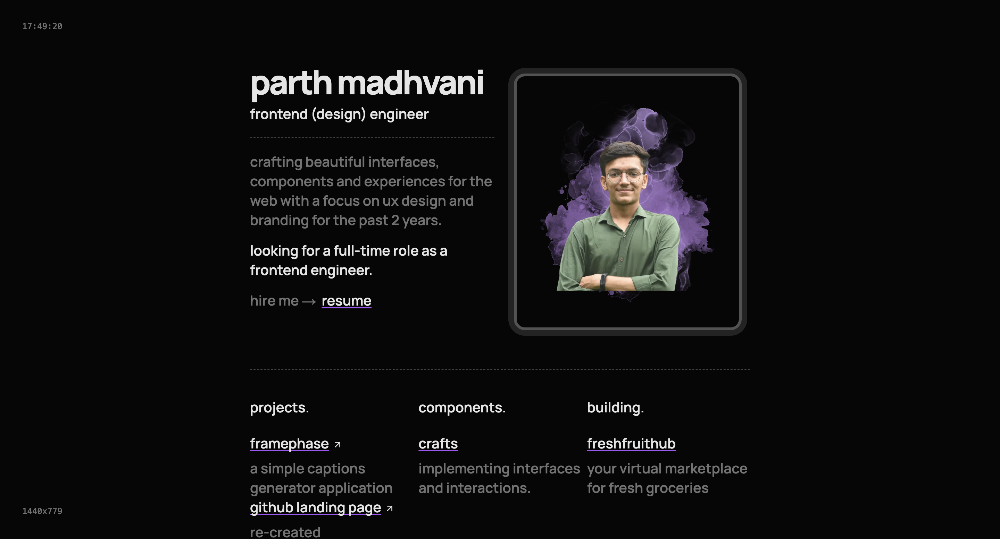

# Parth Madhvani — Portfolio

🌐 **Live Website:** [parthmadhvani2.github.io/MyPortfolio](https://parthmadhvani2.github.io/MyPortfolio/)

## About Me

I’m **Parth Madhvani**, a **product-focused software engineer** from **Surat, Gujarat, India**.  
I currently work at **Hackerzspace**, where I build scalable, user-centric web applications.

My core strength lies in **frontend engineering**, but I’m equally comfortable working across the stack — from designing clean UI systems to integrating APIs, databases, and deployments. I enjoy building products end-to-end, not just features.

## What I Do

- Build modern, responsive, and performant web applications  
- Design scalable UI components and frontend architectures  
- Work across **Frontend, Backend, DevOps, and Web3** when required  
- Turn ideas into real, usable products with strong UX  

**Tech I work with:**  
React, Next.js, JavaScript, Tailwind CSS, Node.js, PostgreSQL, Prisma, REST APIs, Git, CI/CD, and modern frontend tooling.

## Career Vision

My long-term goal is to grow into a **product-driven engineer and founder**.  
I aim to:
- Master system design and scalable architectures  
- Build and ship impactful SaaS products  
- Eventually transition into **product leadership** while continuing to code  

I’m deeply interested in startups, early-stage products, and building things from scratch.

## About This Portfolio

This portfolio showcases:
- Selected projects and case studies  
- My approach to UI/UX and frontend engineering  
- The way I think about products, not just code  

It’s designed to be **clean, fast, and scalable**, just like the products I enjoy building.

## Let’s Connect

- **GitHub:** https://github.com/ParthMadhvani2  
- **LinkedIn:** https://www.linkedin.com/in/parthmadhvani2  
- **Email:** madhvaniparth2@gmail.com  

Feel free to reach out for **collaborations, product discussions, startup ideas, or engineering opportunities**.
