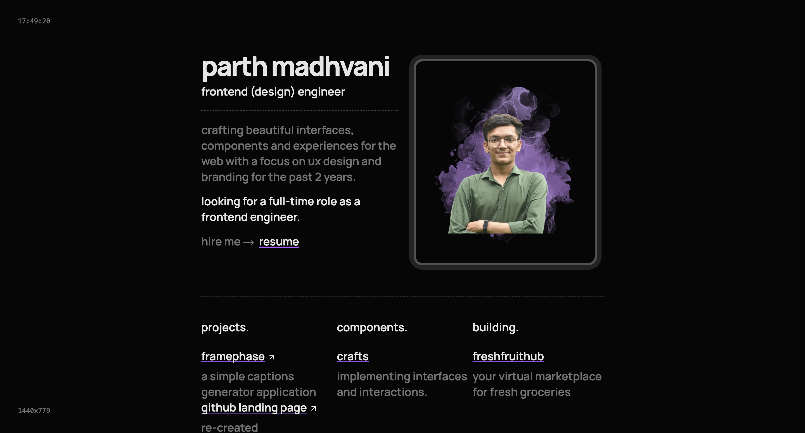

# Parth Madhvani · Portfolio

🌐 **Live:** [parthmadhvani.com](https://parthmadhvani.com)

## About

I build SaaS products end to end. Backend, frontend, mobile, billing, design system, marketing site. Whatever the product needs, I ship it.

Three live products I work on right now:

- **[Embers](https://useembers.com)** · LinkedIn engagement turned into ranked warm leads. I work on the scoring engine, the ICP classifier, the dashboard, and the build-in-public marketing.
- **[Hood Cleaning Report](https://hoodcleaningreport.com)** · NFPA 96 compliance reports for commercial kitchen exhaust contractors. I built the CompanyCam OAuth integration, the photo and document vault, and the PDF pipeline.
- **[SnapCount](https://snapcount.app)** · Real-time multiplayer tally counter, iOS and web. I built the iOS app on Expo's new architecture and the multi-language marketing site.

## What I'm good at

Building the full surface of a product. Most engineers stop at the API or the component. I keep going. Mobile app, billing flow, marketing site, design tokens, post-launch ops.

AI features that solve a real problem. Not "we added a chatbot." Comment intent classification, ICP matching across 7 dimensions, voice-matched DM generation with OpenAI structured outputs.

Django + Celery + Postgres backends that scale without a rewrite. React 19 + TanStack Start frontends that load fast. Expo iOS apps that respect accessibility by default.

## Stack

Django 5, DRF, Celery, PostgreSQL, Redis, OpenAI, Apify. React 19, TanStack Start, Tailwind v4, Shadcn-style primitives, Radix UI, Zod. Expo SDK 53, React Native, TurboModules. Cloudflare Workers, R2, Docker, Wrangler. Dodo Payments, Stripe, JWT, Google OAuth.

## Open to

Full-stack or design-engineer roles where the scope is end-to-end product, not narrow IC tickets.

## Stack (this portfolio site)

Next.js 14 (App Router) · TypeScript · Tailwind CSS · JSON-driven content

## Connect

- **GitHub:** [github.com/ParthMadhvani2](https://github.com/ParthMadhvani2)
- **LinkedIn:** [linkedin.com/in/parthmadhvani2](https://www.linkedin.com/in/parthmadhvani2)
- **Email:** madhvaniparth2@gmail.com
- **Book a call:** [cal.com/parth-madhvani-pjulld/30min](https://cal.com/parth-madhvani-pjulld/30min)
